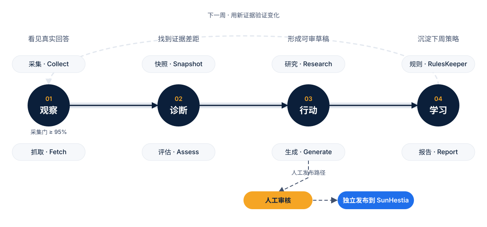

<div align="center">

# ☀️ SunPower Nova

**以 SunHestia 为实验站点，把 GEO 从一次性内容优化变成可复现、可审计的周迭代系统。**

真实 AI 答案采集 · 引用证据分层 · GEO/SEO 独立评估 · 内容生成与人审 · 规则迭代 · HTML 报告

[SunHestia 官网](https://sunhestia.com) · [系统流程](#workflow) · [快速开始](#quick-start) · [文档地图](#docs)


</div>

> [!IMPORTANT]
> SunPower Nova 是 GEO 方法与工程闭环实验，不是商业增长归因系统。模型提及率、引用率、GEO 分和 SEO 分都是诊断信号，不能直接解释为自然曝光、转化或收入增长。

<a id="overview"></a>

## 项目概览

项目包含两条互相配合、边界清晰的主线：

| 主线 | 角色 | 主要产物 | 技术栈 |
| --- | --- | --- | --- |
| [`site/`](site/) | 实验对象与内容发布阵地 | [SunHestia](https://sunhestia.com) 静态官网、产品页与知识内容 | Astro 5、Cloudflare Pages |
| [`geo-agent/`](geo-agent/) | GEO/SEO 实验基础设施 | 周度采集、证据、评分、研究、草稿、规则与报告 | Python、LangGraph、Jinja2、ECharts |

核心问题不是“让模型写一篇文章”，而是建立一条可以反复运行和复核的证据链：

> 模型实际回答了什么 → 使用了哪些来源 → 哪些特征可能与被检索或引用有关 → 内容应如何调整 → 下一周是否出现可重复变化

### 核心能力

| 能力 | 当前实现 |
| --- | --- |
| 真实模型采集 | 通过 Qwen、Doubao、Zhipu 三家已接入的官方联网接口采集答案和来源 |
| 证据分层 | 区分答案正文、答案引用与仅被模型检索过的来源，避免把搜索候选误当成引用 |
| 双评分体系 | GEO 六维与 SEO 五维分别计算，均为 0–100，不合成一个“万能分数” |
| 研究与生成 | Kimi 汇总来源特征和平台画像，并根据 playbook 生成待审核草稿 |
| 人工发布关口 | 自动流程只生成草稿；发布必须经过 `pass` / `minor` 人审和确定性校验 |
| 可恢复编排 | LangGraph + SQLite checkpoint 支持中断恢复，并隔离测试状态与生产状态 |
| 周度可追溯 | 数据、L3 页面缓存、规则版本和报告按周组织；降级与预算耗尽显式呈现 |

<a id="workflow"></a>

## 系统流程

当前实现由 8 个 LangGraph 节点组成。主线是自动周迭代；虚线表示下一周反馈，以及 DAG 之外的人工审核与独立发布。

<picture>
  <source media="(prefers-color-scheme: dark)" srcset="docs/assets/readme/workflow-dark.svg">
  <source media="(prefers-color-scheme: light)" srcset="docs/assets/readme/workflow-light.svg">
  
</picture>

采集结果只有在每个模型的有效记录率达到 95% 后才进入后续流程；未达标时停留在观察阶段补采。

### 数据如何流动

| 层级 | 位置 | 内容 | 用途 |
| --- | --- | --- | --- |
| L1 | `geo-agent/data/raw/w{N}/` | 模型答案、调用元信息、耗时和用量 | 保留原始观测 |
| L2 | L1 记录中的 `l2` | `cited_sources`、`retrieved_sources`、品牌与竞品派生字段 | 区分“引用”与“检索” |
| L3 | `geo-agent/data/sources/w{N}/` | 页面正文、结构信号、语义信号和降级状态 | 支撑评分与来源研究 |
| Snapshot | `geo-agent/data/snapshots/w{N}/` | GSC 与站点静态快照 | 固定当周评估输入 |
| Analysis | `geo-agent/data/analysis/w{N}/` | 评估、研究聚合和规则迭代结果 | 形成可审计结论 |
| Report | `geo-agent/reports/w{N}/report.html` | 中文 HTML 仪表盘 | 面向人工复核与决策 |

<a id="quick-start"></a>

## 快速开始

### 环境要求

| 组件 | 要求 | 用途 |
| --- | --- | --- |
| Python | 3.11 或 3.12 | `geo-agent` 管线与测试 |
| Node.js | 20+ | Astro 站点检查与构建 |
| SQLite | Python 自带 | LangGraph checkpoint |
| 网络代理 | 可选 | 无法直连 GSC 或外站时，在 `targets.yaml` 配置 |

### 1. 安装 GEO Agent

从仓库根目录执行：

```bash
python3.11 -m venv .venv
source .venv/bin/activate
python -m pip install -r geo-agent/requirements.lock
python -m pip install --no-deps -e geo-agent
```

`requirements.lock` 固定第三方依赖；editable 安装只把 `geo` 的 `src` 包注册到当前环境。

### 2. 运行离线测试

```bash
cd geo-agent
python -m pytest
```

普通测试不需要 API 密钥；依赖网络或真实模型的测试会自动跳过。CI 同时执行 Python 测试、Astro 静态检查和站点构建。

### 3. 检查与构建站点

```bash
cd site
npm ci
npm run check
npm run build
```

构建产物位于 `site/dist/`。部署前要求 `npm run check` 无错误、警告和提示；完整发布流程见 [`site/DEPLOY.md`](site/DEPLOY.md)。

<a id="configuration"></a>

## 配置真实周迭代

> [!WARNING]
> 周迭代会调用外部模型和 GSC、写入当周数据，并可能产生费用。它只生成草稿，不会自动发布站点内容。首次运行前应核对周号、规则版本、API 配额、代理和本地数据备份。

### 本地凭据

在 `geo-agent/.env` 中配置需要使用的凭据。该文件和 GSC 私钥已被 Git 忽略，不应提交到仓库。

```dotenv
DASHSCOPE_API_KEY=
ARK_API_KEY=
BIGMODEL_API_KEY=
MOONSHOT_API_KEY=
GSC_KEY_FILE=/absolute/path/to/gsc-service-account.json
```

### 运行参数

| 文件 | 负责内容 |
| --- | --- |
| [`geo-agent/run.yaml`](geo-agent/run.yaml) | 周号、运行模式、采集范围、次数、规则版本和 provider |
| [`geo-agent/run.yaml.example`](geo-agent/run.yaml.example) | 参数说明与无凭据示例 |
| [`geo-agent/targets.yaml`](geo-agent/targets.yaml) | 站点 URL、评估页面、品牌词与当前代理 |
| [`geo-agent/targets.yaml.example`](geo-agent/targets.yaml.example) | 可移植的直连配置示例 |

确认配置后，在 `geo-agent/` 中运行：

```bash
python -m geo.orchestrate.graph --week 4
```

常用参数：

| 参数 | 行为 |
| --- | --- |
| `--week N` | 显式选择生产周；测试保留 `900–999`，生产入口会拒绝该区间 |
| `--next-week` | 完成后把 `run.yaml` 周号原子递增 |
| `--force-new-run` | 忽略同周已有 checkpoint，使用新 run ID 从头执行；会再次调用付费接口 |

默认情况下，同周完整 run 会跳过，部分 run 会从 checkpoint 继续。不要为“确保执行”而习惯性使用 `--force-new-run`。

<a id="quality"></a>

## 质量与安全边界

- **采集门禁**：每个模型有效记录率低于 95% 时停止后续节点，补采后再恢复。
- **证据门禁**：检索候选与答案引用分开保存；URL 型品牌引用按主机而非整条 URL 的字符串子串判断。
- **确定性校验**：数字、JSON-LD、canonical、主题重复和发布状态在写入或归档前检查。
- **人工关口**：草稿只有最新人审为 `pass` / `minor` 才能归档；`flagged` 内容需要带原因的显式 override。
- **历史边界**：W1–W3 已有产物保持冻结；W4 起的新数据与评分语义不反向改写历史输出。
- **降级可见**：抓取、语义解析、robots 和 Research 预算异常进入结果与报告，不静默伪装成正常零值。
- **解释边界**：来源特征是观察性线索；没有同查询、同平台对照时，不能据此宣称因果关系。

<a id="structure"></a>

## 仓库结构

```text
sunpowerNova/
├── geo-agent/
│   ├── src/geo/
│   │   ├── collect/       # 模型采集与 L2 解析
│   │   ├── fetch/         # 页面、GSC 与站点信号
│   │   ├── assess/        # GEO / SEO 评分与竞品差距
│   │   ├── research/      # 来源特征研究与 playbook
│   │   ├── generate/      # 选题、草稿、校验与人审状态
│   │   ├── rules/         # 证据门槛、权重和版本迭代
│   │   ├── report/        # Jinja2 + ECharts 周报
│   │   ├── orchestrate/   # LangGraph 周迭代入口
│   │   └── shared/        # 配置、模型、存储与公共客户端
│   ├── input/             # 冻结 prompt 集
│   ├── knowledge/         # 品牌事实、playbook 与平台画像
│   ├── content/           # 草稿、已发布归档与审核记录
│   ├── rules/             # 当前规则、历史版本与 changelog
│   ├── tests/             # 离线回归、负向用例与黄金锁
│   └── data/ · reports/ · state/   # 本地实验产物，不入 Git
├── site/                  # SunHestia Astro 静态站点
├── docs/
│   ├── superpowers/specs/ # 已确认设计与后续修订
│   ├── superpowers/plans/ # 分阶段实现计划
│   └── archive/           # 被整合设计取代的历史资料
└── .github/workflows/     # Python 与 Astro CI
```

<a id="docs"></a>

## 文档地图

| 想了解什么 | 从这里开始 |
| --- | --- |
| 项目目标、总体架构与评分口径 | [整合设计 v1.1](docs/superpowers/specs/2026-07-29-sunpower-nova-integration-design.md) |
| Research Agent | [P1 Research 设计](docs/superpowers/specs/2026-08-13-p1-research-agent-design.md) |
| Generate Agent 与人工发布关口 | [P2 Generate 设计](docs/superpowers/specs/2026-08-16-p2-generate-agent-design.md) |
| RulesKeeper 与规则版本 | [P3 RulesKeeper 设计](docs/superpowers/specs/2026-08-19-p3-ruleskeeper-design.md) |
| W3 后续修复与工程 backlog | [Backlog 修复设计](docs/superpowers/specs/2026-09-01-backlog-fixes-design.md) · [全量清仓设计](docs/superpowers/specs/2026-09-02-backlog-cleanup-design.md) |
| 对应实现步骤与验收计划 | [`docs/superpowers/plans/`](docs/superpowers/plans/) |
| 站点构建与 Cloudflare Pages 部署 | [`site/DEPLOY.md`](site/DEPLOY.md) |
| 面向汇报的项目叙事 | [SunPower Nova 项目演讲文稿](docs/SunPower-Nova项目演讲汇报文稿.md) |
| 早期方案和人工 W1 资料 | [`docs/archive/`](docs/archive/) |

<details>
<summary><strong>新机器迁移清单</strong></summary>

除 Git 仓库外，还需要迁移以下本地状态：

1. `geo-agent/.env` 与 GSC service account 私钥。
2. `geo-agent/data/`、`geo-agent/reports/` 和 `geo-agent/state/runs.sqlite`。
3. `site/.cf_token` 与 Cloudflare account ID。
4. Python 3.11/3.12、Node 20+，以及目标环境需要的网络代理。
5. GitHub 与 Cloudflare 的本机认证状态。

这些内容包含凭据或不可重建的实验历史，均不应直接提交到 Git。

</details>
