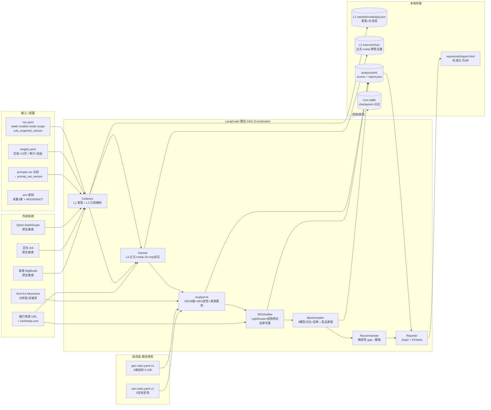

# 系统架构图（分层组件）

> 对应 PRD v4 §8（多 Agent 架构）、§9（技术栈）、§4（数据模型）。
> **静态视图**：谁是什么组件、数据存哪、规则库与密钥如何横切。

## 读图要点

- **四类外部依赖**：3 家采集 API（Qwen/豆包/智谱，原生搜索）+ Kimi K3（分析层，非被测，避免自评偏差）+ 抓取目标（被引来源 + sunhestia.com 自审）。
- **静态 DAG 七节点**：Collect → Fetch → Analyze → SEOAudit → Benchmark → Recommend → Report。条件分支仅「实验/审计模式」「全量/核心」。
- **规则库只读**：`geo/seo-rules.yaml@v1` 是静态快照，Analyst 运行时读取，不在链路里修改（迭代延后）。
- **三层本地存储**：L1 答案、L3 正文+meta（跨周 sha1 去重，不存 raw.html）、analysis 中间产物；`runs.sqlite` 横切做 checkpoint/续跑去重。
- **密钥横切**：`.env`（采集 3 家 + MOONSHOT）被各节点读取，为保持清爽不画数据流边。
- **两个控制变量**（`rule_snapshot_version` / `prompt_set_version`）贯穿全链写进每条记录——见 [02-data-flow.md](02-data-flow.md)。
