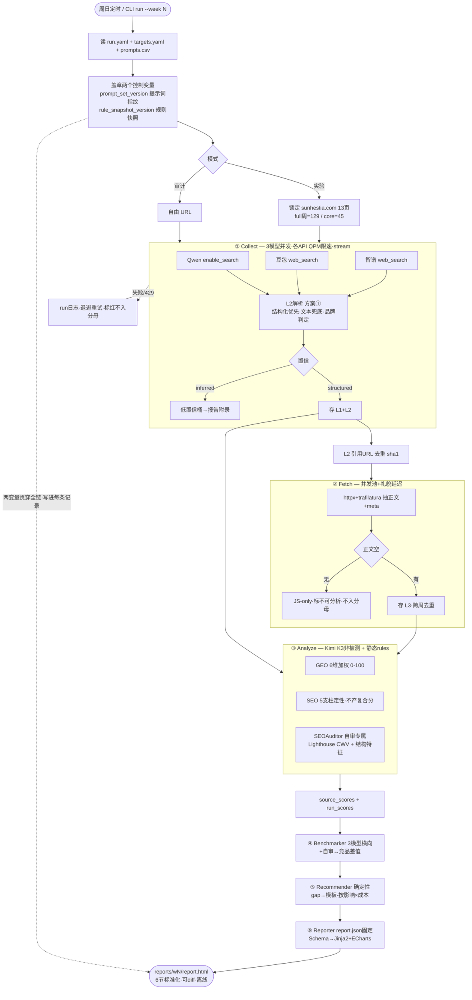

# 运行时数据流（一次 weekly run）

> 对应 PRD v4 §8.1（静态 DAG 范式）、§4.4（L2 解析契约）、§7.4（验收指标）。
> **动态视图**：数据如何从 input 流到 report，L1/L2/L3 在哪产生，控制变量如何贯穿。

## 读图要点

- **六阶段**（① Collect → ② Fetch → ③ Analyze → ④ Benchmark → ⑤ Recommend → ⑥ Report），对应 DAG 节点。
- **控制变量在入口盖章**：`prompt_set_version`（提示词指纹）+ `rule_snapshot_version`（规则快照），虚线表示二者贯穿全链写进每条记录——这是 W1↔W7 可比性的机械保证。
- **两层"不入分母"**：采集失败/429、JS-only 来源都标红隔离，不污染主信号。
- **L2 双通道**：结构化优先（`search_results`/`web_search`），空则文本兜底（正则抽 URL，标 `inferred` 进低置信桶）。
- **确定性输出**：`report.json` 固定 Schema → Jinja2 模板 → 同输入同规则版本产字节级一致 HTML。
- **两层分母口径**（PRD §7.4/§8.1）：采集成功率分母 = 计划 prompt×model 数（全量 129 / 核心 45，失败计入）；mention/citation rate 分母 = 有效采集数。
