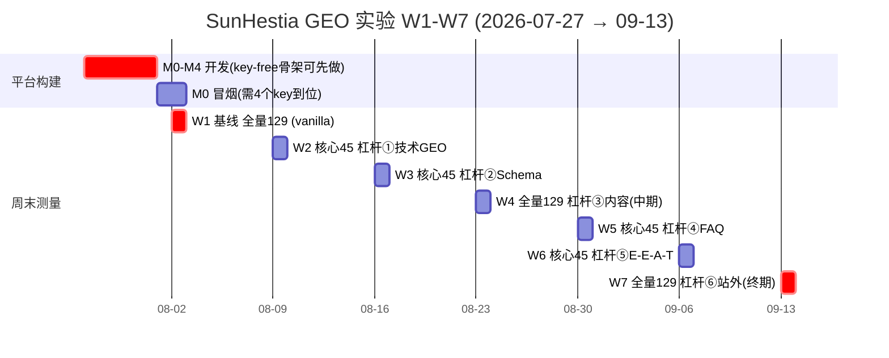

# 实验时间线（W1–W7）

> 对应 PRD v4 §13.1（实验日历）。
> **PM 视图**：暴露 W1 关键路径与 key 依赖。

## 读图要点

- **W1 是单点关键路径**（红色）：M0–M4 开发须在 ~8/1 前完成，才能在 8/2 采基线；而 M0 冒烟卡在 4 个 API key。**今天 7/27 已是 W1 第一天，key 仍是空的 → 基线有滑期风险。**
- **全量周 W1/W4/W7**（129 = 43 题×3 模型），**核心周 W2/W3/W5/W6**（45 = 15 题×3 模型）——测量负载设计为可持续。
- **一周一杠杆归因**：每周只动一个 GEO 维度，citation 变化才能归因到该杠杆。
- **周节奏**：周一二实施杠杆 / 周三五静默 / 周末测量（LLM 索引按周-月更新，周末测的是累积趋势）。
- **杠杆 7→6**：独立的「时效/深度」周并入 W7 收尾。
